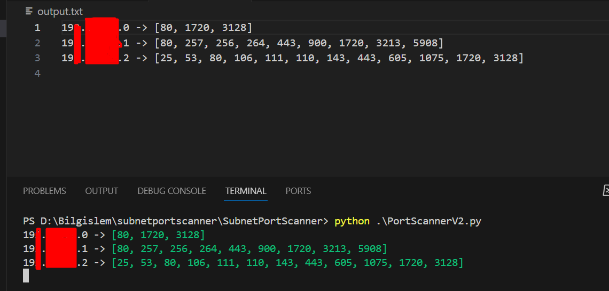

# IP Adresi Port Tarama Aracı

Bu Python betiği, belirli bir alt ağdaki IP adreslerinin açık portlarını taramak için kullanılır. Betik, `socket`, `ipaddress` ve `concurrent.futures` modüllerini kullanır ve tarama sonuçlarını `output.txt` dosyasına kaydeder.

## Örnek Çıktı

Aşağıdaki örnek çıktıda, `output.png` dosyasında görülen tarama sonuçları bulunmaktadır:



## Kullanım

1. `subnet` değişkenini hedef alt ağınızın CIDR gösterimine göre ayarlayın.
2. İstediğiniz başlangıç ve bitiş port aralığını `start_port` ve `end_port` değişkenlerinde belirtin.
3. Kodu çalıştırın ve sonuçları `output.txt` dosyasında bulun.

## Örnek

```python
subnet = "193.x.x.0/24"
start_port = 1
end_port = 6500
